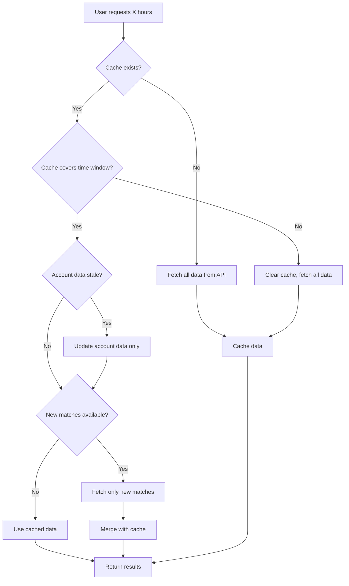

# League of Legends Bot Caching System

This document explains the intelligent caching system implemented in the League of Legends player tracking feature (`ltrack` command) to optimize API usage and improve performance.

## Overview

The caching system dramatically reduces Riot API calls and improves response times by storing match data and player information locally. It's designed to be smart about what data to cache and when to fetch new data.

## Cache Architecture

### Two-Tier Cache System

1. **Match Cache** (`MATCH_CACHE`)
   - Stores individual match details by match ID
   - TTL: 7 days (matches never change once completed)
   - Max capacity: 10,000 matches
   - Cache key: Match ID string

2. **Player Cache** (`PLAYER_CACHE`)
   - Stores player data including summoner info, league entries, and match history
   - TTL: 1 hour (allows for rank updates)
   - Max capacity: 1,000 players
   - Cache key: `GameName#TagLine:platform` format

### Cache Data Structures

```rust
struct CachedPlayerData {
    summoner: Summoner,
    league_entries: Vec<LeagueEntry>,
    account: RiotAccount,
    matches: Vec<Match>,
    last_updated: DateTime<Utc>,
    oldest_match_timestamp: DateTime<Utc>,
}
```

## How It Works

### Initial Request (Cache Miss)
1. User requests 100 hours of data for a player
2. No cached data exists
3. Bot fetches all match IDs and match details from Riot API
4. Data is cached for future use
5. Results are returned to user

### Subsequent Request (Cache Hit)
1. User requests 100 hours of data for the same player
2. Bot checks cache and finds existing data
3. Bot determines what portion of cached data is still relevant
4. Only new matches (if any) are fetched from the API
5. Cached and new data are merged and returned

### Smart Cache Updates
- **Scenario**: User requests 100 hours, plays 5 hours, then requests 100 hours again
- **Behavior**: Only the newest 5 hours are fetched from API
- **Benefit**: 95% reduction in API calls

## Cache Logic Flow



## Performance Benefits

### API Call Reduction
- **Without cache**: 100+ API calls per request
- **With cache**: 0-10 API calls for subsequent requests
- **Cache hit rate**: Often 90%+ for repeated queries

### Response Time Improvement
- **Without cache**: 30-120 seconds for 100 hours
- **With cache**: 1-5 seconds for cached data
- **User experience**: Near-instant results for repeated queries

### Rate Limit Compliance
- Prevents API spam across multiple users
- Allows more users to use the bot simultaneously
- Reduces risk of hitting Riot API rate limits

## Cache Management

### Automatic Management
- **TTL-based expiration**: Old data automatically expires
- **LRU eviction**: Least recently used data is removed when capacity is reached
- **Memory efficiency**: Uses moka cache with configurable memory limits

### Manual Management
- **`-cache_stats`**: View cache statistics and hit rates
- **`-cache_stats clear`**: Clear all cached data (owner only)
- **Logging**: Comprehensive cache performance logging

## Implementation Details

### Cache Libraries
- **moka**: High-performance, concurrent cache library
- **Features**: TTL, LRU eviction, async support, memory management

### Thread Safety
- All cache operations are thread-safe
- Multiple users can query simultaneously without conflicts
- Atomic cache updates prevent data corruption

### Memory Management
- Configurable max capacity prevents unbounded growth
- Weighted memory usage tracking
- Automatic cleanup of expired entries

## Cache Statistics

The bot tracks and reports:
- Cache hit rates per request
- Total cached entries
- Memory usage
- Cache efficiency metrics

Example output:
```
Using 50 matches (5 new, 100.0h total)
Cache Efficiency: 90.0%
```

## Best Practices

### For Users
- Repeated queries on the same player are very fast
- Longer time windows benefit more from caching
- Cache clears automatically, no manual intervention needed

### For Developers
- Monitor cache hit rates in logs
- Adjust TTL values based on usage patterns
- Consider cache warming for popular players
- Use appropriate cache keys to avoid collisions

## Configuration

### Cache Settings
```rust
// Match cache: 7 days TTL, 10k capacity
Cache::builder()
    .max_capacity(10_000)
    .time_to_live(Duration::from_secs(86400 * 7))
    .build()

// Player cache: 1 hour TTL, 1k capacity
Cache::builder()
    .max_capacity(1_000)
    .time_to_live(Duration::from_secs(3600))
    .build()
```

### Environment Variables
No additional environment variables required - caching works automatically.

## Monitoring and Debugging

### Log Messages
- Cache hits/misses are logged with player identifiers
- Cache efficiency metrics are logged per request
- Cache update operations are tracked

### Debug Commands
- Use `-cache_stats` to see current cache state
- Monitor bot logs for cache performance
- Clear cache if data seems stale

## Future Improvements

### Potential Enhancements
- **Persistent cache**: Save cache to disk across bot restarts
- **Cache warming**: Pre-populate cache with popular players
- **Smart prefetching**: Predict and cache likely future requests
- **Regional cache**: Separate caches per region
- **Match prediction**: Cache matches likely to be requested

### Scalability Considerations
- Database-backed cache for production deployments
- Distributed caching for multi-instance setups
- Cache sharding for very large datasets

## Troubleshooting

### Common Issues
1. **High memory usage**: Reduce cache capacity in configuration
2. **Stale data**: Cache TTL may be too long for rapidly changing data
3. **Low hit rates**: Users may be querying different players/time windows

### Solutions
- Monitor cache statistics regularly
- Adjust TTL values based on data freshness requirements
- Use cache clearing commands if data appears incorrect
- Check logs for cache performance insights

---

This caching system ensures optimal performance while respecting Riot API rate limits and providing an excellent user experience.